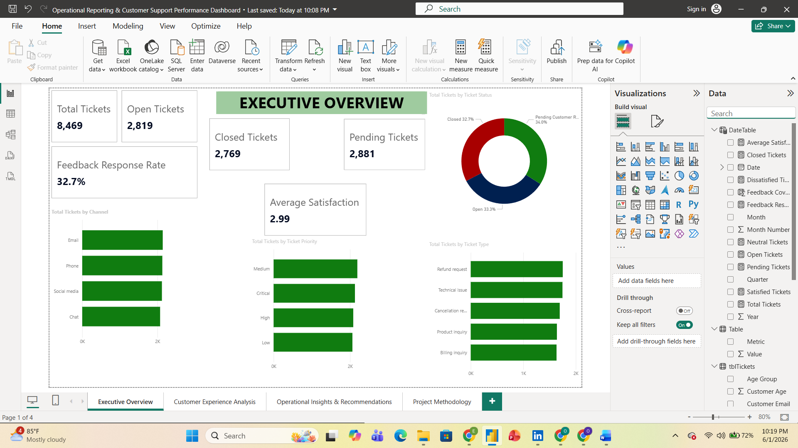
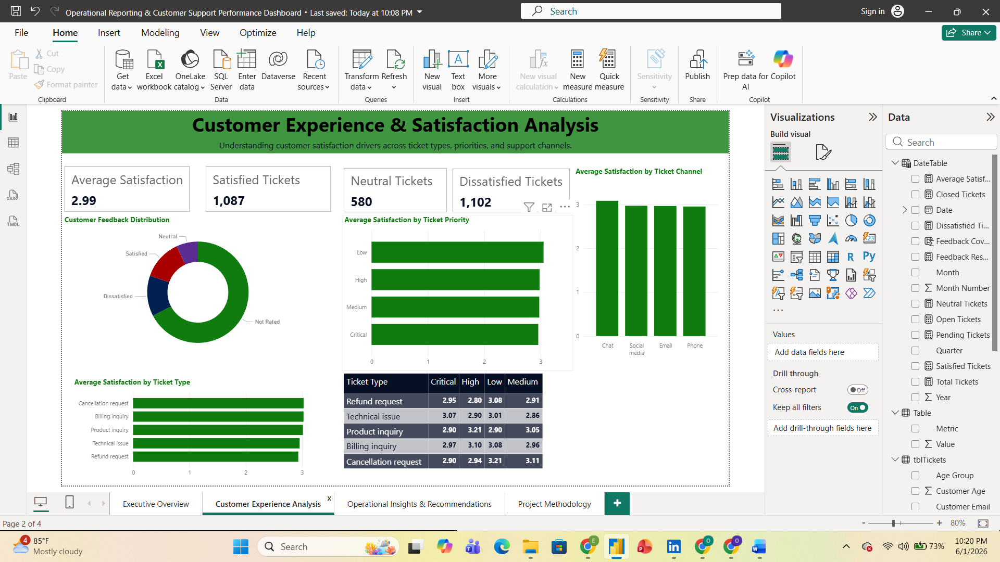
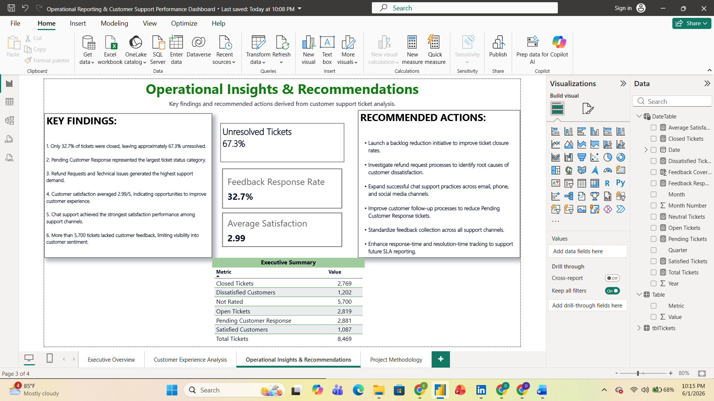
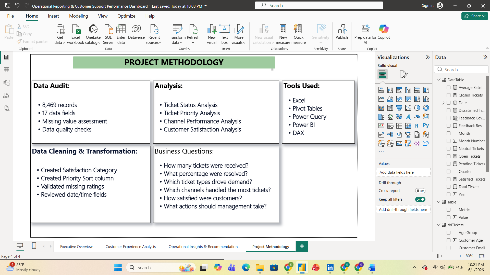

# Customer Support Performance & Satisfaction Analysis Dashboard

## Project Overview

This project analyzes customer support ticket data to uncover operational bottlenecks, customer satisfaction trends, and actionable business recommendations.

The objective was not simply to build a dashboard but to transform raw support ticket data into actionable insights that management could use to improve customer experience, optimize support operations, and prioritize business decisions.

---

## Business Problem

Customer support teams handle thousands of tickets across multiple communication channels, priorities, and issue categories.

Management needed answers to critical operational questions:

* How many tickets were received?
* What percentage of tickets were successfully resolved?
* Which ticket types generated the highest demand?
* Which support channels handled the largest workload?
* How satisfied were customers with support services?
* What operational improvements should be prioritized?

---

## Dataset Information

### Dataset Summary

| Metric           | Value                    |
| ---------------- | ------------------------ |
| Total Records    | 8,469                    |
| Total Columns    | 17                       |
| Dataset Type     | Customer Support Tickets |
| Analysis Tool    | Power BI                 |
| Data Preparation | Excel & Power Query      |

### Technology Stack

* Excel
* Pivot Tables
* Power Query
* DAX
* Power BI

---

## Data Preparation

The dataset was reviewed, cleaned, and transformed before analysis.

### Data Quality Checks

* Missing value assessment
* Validation of customer ratings
* Review of date and time fields
* Consistency checks across ticket categories

### Data Transformation

* Created Satisfaction Category field
* Created Priority Sort Column
* Standardized ticket classifications
* Prepared fields for DAX calculations and dashboard reporting

---

## Dashboard Pages

### Executive Overview

Provides a high-level summary of ticket volume, ticket status distribution, customer feedback coverage, satisfaction performance, and operational workload.

### Customer Experience Analysis

Explores customer satisfaction across:

* Ticket Types
* Ticket Priorities
* Support Channels

### Operational Insights & Recommendations

Summarizes critical findings and translates analytical results into business recommendations.

### Project Methodology

Documents the complete analytical process from data audit and cleaning through business analysis and dashboard development.

---

# Dashboard Preview

## Executive Overview

## Customer Experience Analysis

## Operational Insights & Recommendations

## Project Methodology

---

## Key Findings

### Operational Performance

1. Only 32.7% of tickets were successfully resolved.
2. Approximately 67.3% of tickets remained unresolved.
3. Pending Customer Response represented the largest ticket status category.

### Customer Demand

4. Refund Requests generated the highest support demand.
5. Technical Issues represented another major support driver.

### Customer Satisfaction

6. Average customer satisfaction was 2.99 out of 5.
7. More than 5,700 tickets lacked customer feedback.
8. Chat support achieved the strongest satisfaction performance among support channels.

---

## Business Recommendations

### Immediate Actions

* Launch a backlog reduction initiative to improve ticket closure rates.
* Improve customer follow-up processes to reduce pending-response tickets.
* Strengthen ticket resolution workflows.

### Customer Experience Improvements

* Investigate refund-request bottlenecks.
* Expand successful chat-support practices across other channels.
* Improve customer communication processes.

### Reporting & Governance

* Standardize feedback collection across all support channels.
* Enhance SLA monitoring and operational reporting.
* Implement routine customer-satisfaction tracking.

---

## Skills Demonstrated

### Data Analytics

* Data Cleaning
* Data Transformation
* Exploratory Data Analysis
* Data Quality Assessment

### Business Intelligence

* Dashboard Design
* Data Visualization
* KPI Development
* Executive Reporting

### Technical Skills

* Power BI
* DAX
* Power Query
* Excel
* Pivot Tables

### Business Skills

* Business Storytelling
* Operational Analysis
* Insight Generation
* Recommendation Development

---

## Project Outcome

The analysis identified operational inefficiencies, customer-service bottlenecks, and opportunities for improving customer satisfaction.

The resulting dashboard provides management with a centralized view of support performance while enabling data-driven decisions that can improve both operational efficiency and customer experience.

---

## Author

**Olajide Oluwafemi Eniola**

Data Analyst | Power BI | SQL | Excel | Business Intelligence
